### AW3D30 to WGS84 Web Mercator zxy quadtree conversion
- [jaxa description](https://www.eorc.jaxa.jp/ALOS/en/dataset/aw3d30/aw3d30_e.htm)
- [opentopography description](https://portal.opentopography.org/raster?opentopoID=OTALOS.112016.4326.2)

#### Data download (220 GB)
- Install aws cli: https://docs.aws.amazon.com/cli/latest/userguide/getting-started-install.html
- aws s3 cp s3://raster/AW3D30/ . --recursive --endpoint-url https://opentopography.s3.sdsc.edu --no-sign-request
- Took 50min@586MB/s
- python3 -m pip install numpy pygeodesy rasterio opencv-python
- download online egm96-5.pgm, EGM96 geoid (18 MB)

#### Encoding
- The [pseudo base-256 rgb24 encoding](https://github.com/mapbox/rio-rgbify)
- -10000 + ((R * 256 * 256 + G * 256 + B) * 0.1)
- Runtime convert to float texture, so vertex shader don't need to spam the conversion

#### Conversion speed
- Precompute heightmap for egm96 (gravitational undulation calculations are slow)
- Operate with lists instead of single elevation samples
- Don't save tiles with no elevation data (image encoder slow)
- Early exit by testing output tile corners for elevation data existence
- multiprocessing
- After optimization image encoder remains as a bottleneck
- Level 10 output size 13GB

#### Image data under jaxa licence:

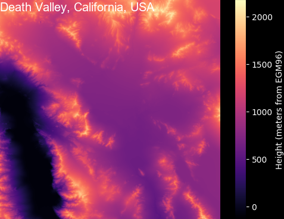  
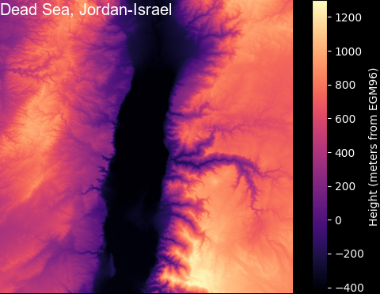  

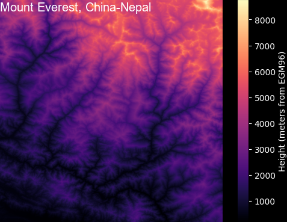  
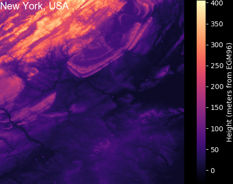  

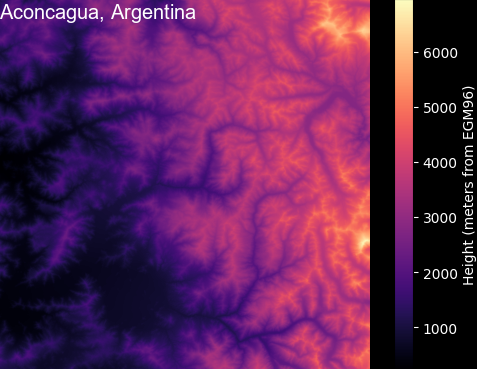  
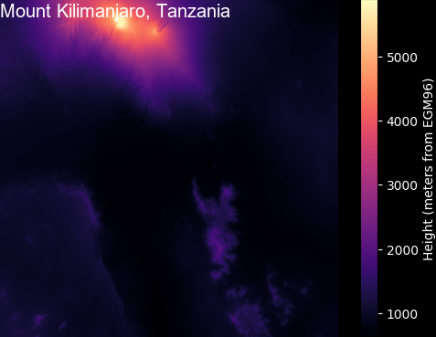  

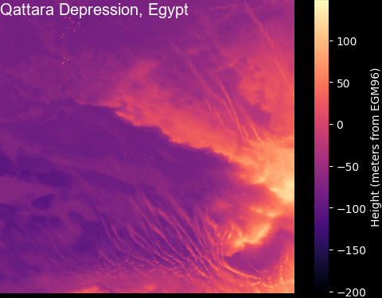  
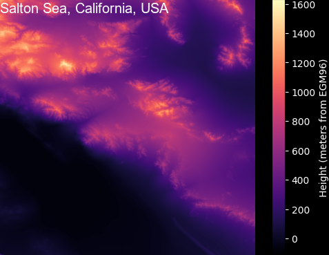  

  
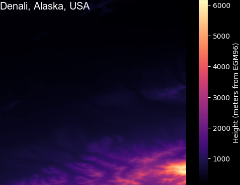  

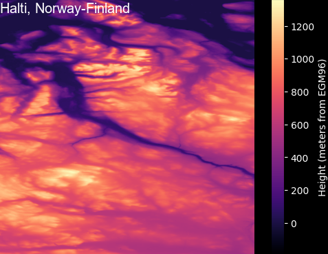  
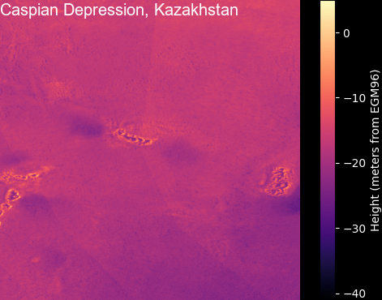  

